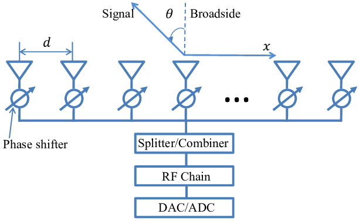
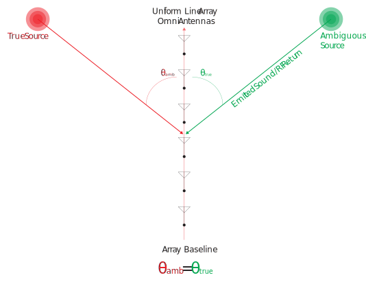
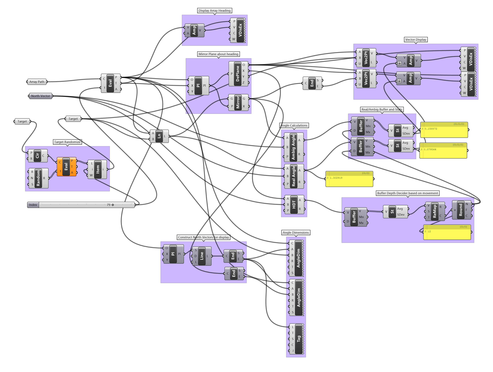

# RF Bearing Disambiguation
This work was derived some work projects I've worked on at various times both in sonar and radar. The concepts are the same. I wanted to consolidate my notes and mess around with relative target and sensor motion in a graphical environment. 

## What is Ambiguous Bearing?
In all uniform line arrays (ULA); angle can be determined fairly preciesly, it manifest as both **true angle** and **ambiguous angle**. This is a facet of the sensor type and is not unique to any particular domain (sonar, radar etc...)  

 

In the above image of a conventional transmitting phased array [source link](https://www.researchgate.net/figure/Structure-of-a-uniform-linear-array-ULA-with-analog-beamforming-using-phase-shifters_fig1_316921399) we can see that a signal has a specific angle relativel to the beam of the array (left-right on the screen). Since the antennas are implied to be directional, the image somehwat simplifies the issue. If the antennas were omnidirectional, there would exist another possibility of the signal being mirror across the array. 

As we see in thea above diagram, when the antennas are omnidirectional, this creates a but a true and ambiguous bearing. 

## Solving With Movement
Introducing motion is one solution this problem. Either the target, the array or both can be moving. 

### Important Caveat 1
If both the array baseline remains on the same course and the target remains at the same relative heading; motion disambiguation will be impossible. 

### Important Caveat 2
A global direction frame needs to be know for this to work. In these examples it is true north (although could be magnetic, with sufficient compensation). In a system using movement for disambiguation, a heading reference of sufficient speed and quality would be required. 

## Example

What's happening in the above animation:
In the above screen capture we have the following:
- Array baseline (in this case symbolized as a point, but it is assumed to be a ULA)
- Array baseline travel (the curved line)
- A stationary target (circle in the upper left)
  - In order to not make this too easy, I simulated some sensor error by picking random points on the circle to be our true/ambiguous bearing
- Certainty Arrows for ambiguous and true bearing (red and green)
  - The arrows dynamically scale to the "certainty" of the algorithm.
  - If the arrows are equal length, the algorithm is unable to determine the true bearing

And an example with a moving target

## So How Does This Work?

- By comparing the real angle and the ambiguous angle against the array true heading (North in this case) we can see the following
  - The `Real Bearing/North Angle` varies fairly little
  - The `Ambiguous Bearing/North Angle` varies hugely 
- By putting these angles into a rolling buffer we can then run basic statistics on them. In this case we look at the standard deviation of all the buffer and pick the one that has least deviation. 

#### Extra Points
- During times that we approach non-changing angles (see caveat 1) we can interactively extend the size of the buffer. We would then look at more data points to derive our change analysis. During periods of greater change, we can look at fewer points to make a decision.

Although I implemented this in one of my favorite tools (Grasshopper), it could be easily implemented in almost any language. 

## Grashopper Scripting
I put this tooling together with one of my favorite prototype tools, Grasshopper. I've annotated the scripting to make it easier to follow.

[Link to grasshopper script file](GH-scripting)